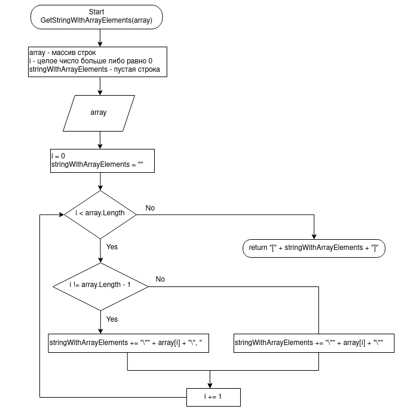

About the repository
====================

This is a repository with completed test work.

**Task**
--------

Write a program that forms a new array of strings from an existing array of 
strings that are less long or equal to 3 characters. The initial array can be 
entered from the keyboard, or set at the start of the algorithm execution. When
deciding, it is not recommended to use collections, it is better to do only 
with arrays.

*Examples*:

[“Hello”, “2”, “world”, “:-)”] → [“2”, “:-)”]

[“1234”, “1567”, “-2”, “computer science”] → [“-2”]

[“Russia”, “Denmark”, “Kazan”] → []

**Description solutions task**
------------------------------
In order to solve the task you need:
1. **Make a block diagram** of the program execution algorithm. I will use https://app.diagrams.net/

2. **Decompose the task**. I create methods that solve specific small problems.

>**ProgramCheck()**. The method prints test information to the console. 

>>**Test(string[] originalArray, int stringLength)**. The method tests the program with test data sets.

>**CountStringsRequiredLength(string[] array, int requiredLength)**. Method for counting the number of strings of the source array that satisfy given condition (their length is less than or equal to 3 characters). Needed to determine the size of the new array. Return integer.

>**FillArrayWithStrings(string[] array, string[] newArray, int requiredStringLength)**. The method from the original array of strings will form a new array of strings whose length is less than or equal to 3 characters.

>**PrintResult(string[] arrayA, string[] arrayB)**. Method for formatted output of results to the console.

>>**GetStringWithArrayElements(string[] array)**. Helper method. Return string formatted output of array elements.

**Solution with Loop:** you can use all the methods described above.

OR

**Simple solution:** you can use the built in array method **FindAll()**.
The **Array.FindAll()** method in C# is used to retrieve all the elements that match the conditions defined by the specified predicate.

        string[] testArray1 = {"Hello", "2", "world", ":-)"};

        string[] group = Array.FindAll(testArray1, testArray1 => testArray1.Length <= 3);
        
        PrintResult(testArray1, group);

Output into Console:
        
        ["Hello", "2", "world", ":-)"] -> ["2", ":-)"]

